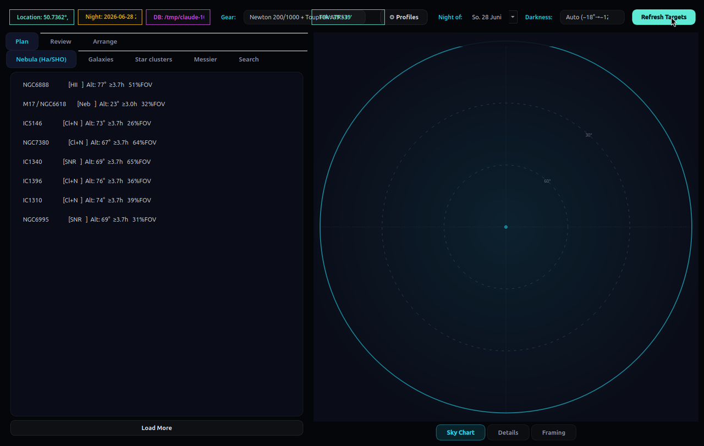
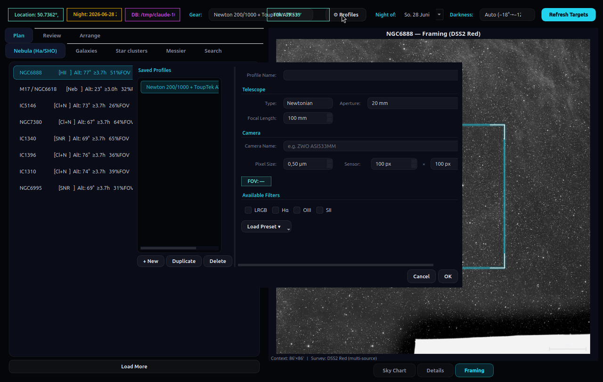
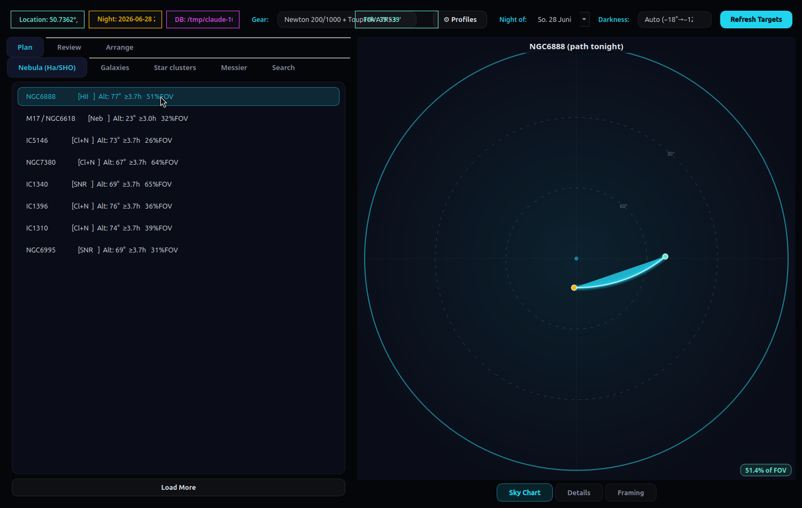
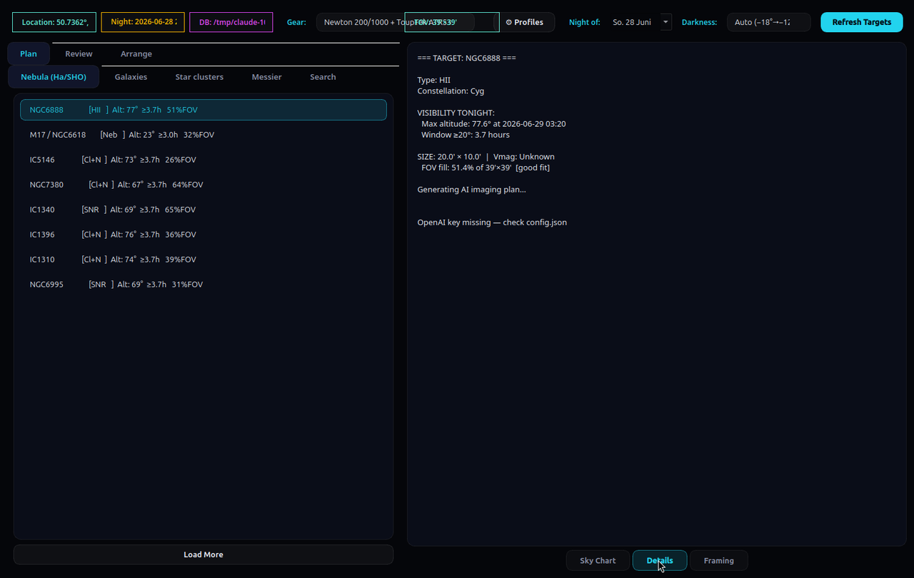
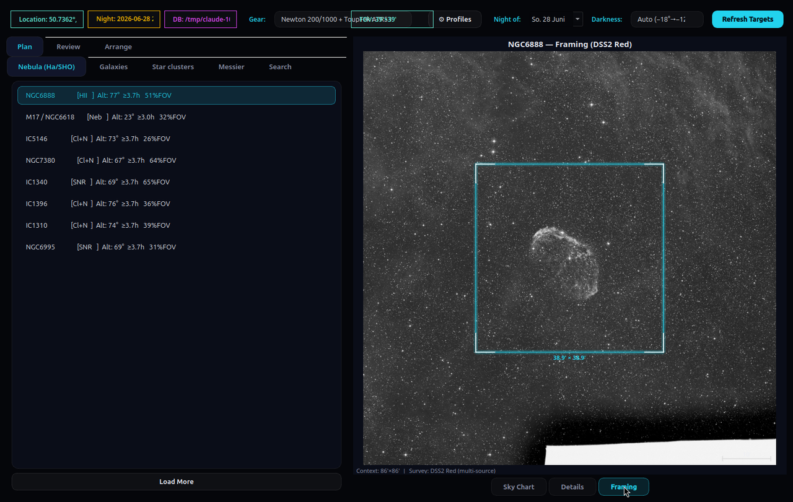
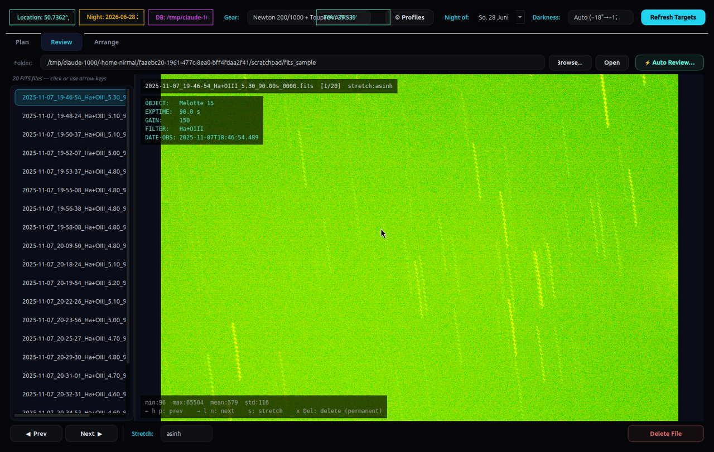
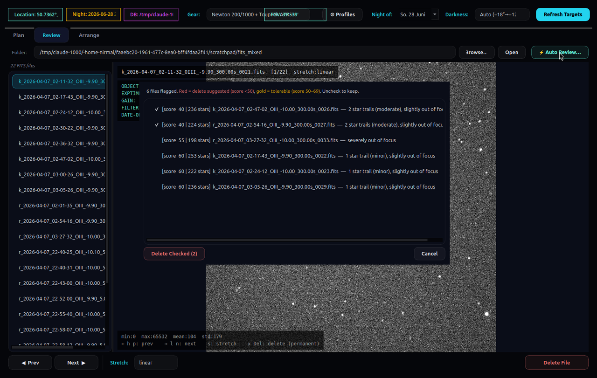
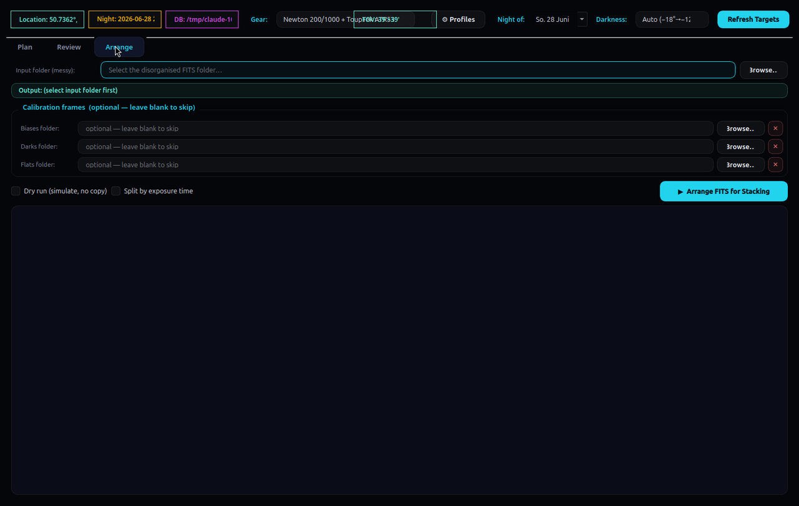

# Astro Toolkit — Hands-On Tutorial

A task-oriented walkthrough of the three-tab imaging workflow: **Plan → Review → Arrange**.
Where the [README](README.md) is the reference manual, this is the "sit down and actually use it"
guide. It assumes a Linux desktop (tested on Ubuntu 26.04 / Qt 6.10) and was verified against a
freshly built `build/astro_toolkit`.

---

## 0. The mental model

The app mirrors the real life-cycle of one imaging project, left to right across the top tabs:

```
   PLAN                      REVIEW                    ARRANGE
   ─────                     ──────                    ───────
   "What should I shoot      "Which of last night's    "Sort this pile of FITS
    tonight, and how?"        subs are keepers?"         into a stacker-ready tree."
   • pick a target           • flip through frames      • group lights by target/filter
   • see its sky path        • 4 stretch modes          • auto-match darks/flats/bias
   • frame it to your sensor • Auto Review culls junk   • output → feed to Siril
   • get an AI imaging plan   • delete bad subs
```

You don't have to use all three. Many nights you'll live in **Review** only. But the tabs are
ordered the way a project flows, so this tutorial follows the same order.

---

## 1. Build and launch (5 minutes)

All dependencies are standard distro packages. On Ubuntu/Debian:

```bash
sudo apt-get install qt6-base-dev libcurl4-openssl-dev libcfitsio-dev \
    nlohmann-json3-dev cmake pkg-config libgps-dev
```

Then build the single-binary app:

```bash
git clone https://github.com/nirmaljangid/astrotools.git
cd astrotools
cmake -B build -DCMAKE_BUILD_TYPE=Release
cmake --build build -j$(nproc)
```

The compile is fast (one translation unit, ~10–15 s). The binary lands at `build/astro_toolkit`.

**Seed the object catalogue** before first run — the planner needs it:

```bash
mkdir -p ~/.astro_gui
cp data/catalog.sqlite ~/.astro_gui/catalog.sqlite     # bundled OpenNGC catalogue (~14k objects)
```

Launch:

```bash
./build/astro_toolkit
```

> On first launch the app writes `~/.astro_gui/config.json` with defaults and tries to detect your
> location (gpsd → IP geolocation). A one-line `qt.sql ... connection still in use` message on stderr
> is harmless — it's a background catalogue query closing its thread connection.


*The main window — Plan tab, with tonight's ranked nebulae and the sky-chart panel.*

---

## 2. First-run setup: tell it about your gear (2 minutes)

The single most useful thing to do before planning is to create a **gear profile**. It drives the
FOV indicator, the framing overlay, and the AI plan prompt.

1. On the **Plan** tab, click **⚙ Profiles** (top toolbar).
2. Click **Add** (or pick a built-in preset as a starting point) and fill in:

   | Field | Example (a typical astrograph) |
   |---|---|
   | Name | `Newton 200/1000 + ToupTek ATR533MM` |
   | Scope type | Newtonian |
   | Focal length | `1000` mm |
   | Aperture | `200` mm |
   | Camera | `ToupTek ATR533MM` |
   | Pixel size | `3.76` µm |
   | Width × Height | `3008 × 3008` px |
   | Filters | tick LRGB / Hα / OIII / SII as owned |

3. Make sure your profile is the **active** one (it's saved straight into `config.json`).

The FOV it derives from those numbers (`focal length`, `pixel size`, sensor dimensions) is what the
planner uses to filter out targets that are too big or too small for your rig — and to draw the
framing rectangle later.


*The ⚙ Profiles dialog — saved profiles on the left, telescope/camera/filter fields on the right, with built-in presets via Load Preset.*

---

## 3. PLAN — find tonight's target (the 10-minute first session)

The Plan tab has category sub-tabs across the top — **Nebula (Ha/SHO)**, **Galaxies**,
**Star clusters**, **Messier**, **Search** — all sharing one right-hand panel.

### 3.1 Set the night

Top of the tab:

- **Night of:** date picker — defaults to tonight; change it to plan ahead.
- The **Location**, **Night** (dark window) and **DB** chips show what the planner resolved.
- Click **Refresh Targets** to (re)run the whole plan for the chosen night.

Under the hood the planner computes, for every candidate, an altitude-vs-time path across the dark
window and keeps only objects that clear your **minimum altitude** (default 30°) for at least your
**minimum hours** (default 4 h). Those two thresholds live in `config.json` as `min_alt_deg` and
`min_hours_above`.

### 3.2 Read the ranked list

Open any category (they load lazily the first time). Objects are **scored and ranked** so the best
things to shoot tonight float to the top. The score rewards:

- **High max altitude** and **long time above the horizon** (the dominant factors),
- **Brightness** (lower magnitude = higher score),
- **Apparent size** (bigger "showpiece" objects),
- **Messier membership** and a curated **famous-object** bonus (M42, M31, NGC7000, the Veil, etc.),
- For nebulae, an extra nudge for emission/HII and planetary/supernova-remnant types.

Tiny, obscure, non-Messier objects under ~10′ get a penalty so the list stays practical. With a gear
profile set, anything that doesn't fit roughly 20–90 % of your sensor's long axis is filtered out
entirely. Click **Load More** to page deeper into a category.

### 3.3 Inspect a target — three right-hand views

Click any object, then switch the right panel with the three buttons at the bottom:

- **Sky Chart** — the altitude-vs-time arc for the object across tonight's dark window, with its
  culmination marked. This is your "when do I shoot it" view.
- **Details** — full catalogue data (type, constellation, RA/Dec, magnitude, size) plus the
  **AI imaging plan** (see §3.4).
- **Framing** — pulls a DSS sky-survey image of the field and draws **your sensor footprint to
  scale** on top, so you can see whether the object fits, needs a mosaic, or swims in empty space.
  (Requires a gear profile and a network connection for the survey fetch.)


*Sky Chart — NGC 6888 selected; its altitude-vs-time arc is drawn across tonight's dark window, with the FOV-fit badge bottom-right.*


*Details — full catalogue readout: type, constellation, max altitude and time, visible window, size and FOV fill. (The AI plan slots in here when an OpenAI key is set; keyless it just notes "key missing".)*


*Framing — the real DSS survey image of NGC 6888 (Crescent Nebula) with your sensor rectangle drawn to scale: an easy "does it fit?" check.*

### 3.4 Get an AI imaging plan (optional)

If you've added an OpenAI key, the **Details** view generates a concise, target- and gear-specific
plan: recommended strategy (SHO / HOO / LRGB+Hα), sub-exposure seconds per filter, total integration
and the % split, plus gain/offset, dithering, autofocus cadence and processing tips.

To enable it, add your key to `~/.astro_gui/config.json`:

```json
{
  "openai_api_key": "sk-...",
  "openai_model":   "gpt-4o-mini"
}
```

If the key is empty or malformed the rest of the app is unaffected — you just get a "key missing"
note instead of a plan. **Treat that key like a password** (see §7).

### 3.5 Search for a specific object

The **Search** sub-tab takes free text or a catalogue ID: `M42`, `NGC7000`, `IC1805`, or a partial
name. It normalises `NGC7000`/`NGC 7000` for you and searches names + IDs.

---

## 4. REVIEW — cull last night's subs

Switch to the **Review** tab. This is the FITS browser + quality-control workbench.

### 4.1 Open a folder

1. Click **Browse…** (or paste a path and press **Open**/Enter). The last folder is remembered
   between sessions.
2. The left list fills with every `.fit/.fits/.fts` found **recursively**.
3. Click a file, or use **◀ Prev / Next ▶**, to load it into the viewer.


*Review — a real Hα+OIII sub loaded (asinh stretch), the file list on the left, header overlay top-left and a histogram strip along the bottom.*

### 4.2 Look at the frame

- The **Stretch** combo cycles four display stretches: `linear`, `sqrt`, `log`, `asinh`. `asinh` and
  `log` are best for pulling faint nebulosity out of a linear sub; `linear` shows it as the sensor
  saw it.
- Keyboard shortcuts (click the image first so the canvas has focus):

  | Key | Action |
  |---|---|
  | `→` `l` `n` | Next file |
  | `←` `h` `p` | Previous file |
  | `s` | Cycle stretch mode |
  | `x` `Del` | Delete current file (with confirmation) |

- **Delete File** permanently removes the current sub after a confirmation prompt — use it for the
  obvious throwaways (cloud-killed, satellite-streaked, wind-shaken).

### 4.3 Auto Review — let it find the bad frames

Click **⚡ Auto Review…** to score *every loaded light frame* automatically. It runs in a background
thread (the status bar shows `Auto-reviewing N/total…`); a 6000×4000 frame takes ~1–3 s.

**How the scoring works** (worth understanding so you trust it):

1. **Calibration frames are skipped.** It reads the `IMAGETYP` header first; anything marked
   `bias`/`dark`/`flat` is left alone.
2. **Star detection** on the raw pixels: it estimates background + noise (median / MAD), thresholds
   everything above `background + 5σ`, then labels connected blobs and classifies each by shape:
   - small round blob → **valid star**
   - long thin blob (aspect ≥ 4.5) → **star trail**
   - big round blob (> 50 px) → **out of focus**
3. Each frame starts at **100** and loses points:

   | Issue | Penalty |
   |---|---|
   | Star trails | −20 each, capped at −65 (so 1–2 trails are survivable) |
   | Slight defocus (blob 50–100 px) | −20 |
   | Severe defocus (blob > 100 px) | −45 |
   | Low star count (< 15, when focus is fine) | −2 per missing star |

4. Results are bucketed and shown worst-first:

   | Score | Meaning | In the dialog |
   |---|---|---|
   | **≥ 70** | Good | not listed |
   | **50–69** | Tolerable | listed in **gold**, **unchecked** |
   | **< 50** | Delete suggested | listed in **red**, **pre-checked** |

5. The results dialog lists each flagged file with its score, star count and reason. **You stay in
   control:** uncheck anything you want to keep, then **Delete Checked** removes only the ticked
   files. A single minor trail or slight defocus typically lands at ~80, so it won't even appear —
   the tool is deliberately conservative about suggesting deletions.


*Auto Review on a mixed set — flagged subs listed worst-first, each with its score and reason ("star trails (moderate), slightly out of focus"). Red rows are pre-checked for deletion; you confirm with Delete Checked.*

---

## 5. ARRANGE — build a stacker-ready folder tree

Switch to the **Arrange** tab. This takes one messy capture folder and produces a clean tree you can
hand straight to Siril (or any stacker).

### 5.1 Point it at your frames

1. **Lights folder** — the folder holding your light subs (scanned recursively).
2. **Calibration frames (optional)** — separate fields for **bias**, **darks**, **flats**; leave any
   blank to skip. Paths are remembered between sessions.
3. Optional toggles:
   - **Split by exposure time** — adds a per-exposure subfolder (`Target/Filter/300s/lights/`),
     handy when one target mixes exposure lengths.
   - **Dry run (simulate, no copy)** — logs exactly what *would* be created and where, without
     copying a single byte. Run this first to sanity-check the grouping, then untick it for real.


*Arrange — input (messy) folder, optional bias/darks/flats folders, and the Dry-run / Split-by-exposure toggles above the "Arrange FITS for Stacking" button.*

### 5.2 What it builds

Each light is read for its `OBJECT` and `FILTER` headers and copied into:

```
arrange_<sourcefolder>/
  <Target>/
    <Filter>/
      [<exposure>s/]        # only if "split by exposure" is on
        lights/   ← your light subs
        darks/    ← matched dark frames (if provided)
        flats/    ← matched flat frames (if provided)
        bias/     ← matched bias frames (if provided)
```

Calibration frames are **matched to each light group**, not blindly copied:

- **Gain** within 15 % (or ±1 ADU),
- **Exposure** within 10 % (or ±0.5 s) — relevant for darks,
- **Sensor dimensions** must match **exactly**.

Unknown header values (`-1`/`0`) are treated as "match anything", so partial metadata still sorts.
Files are **copied, not moved** — your originals are never touched. The log pane shows every
`source → Target/Filter/lights/` decision as it goes.

### 5.3 Then stack

Open `arrange_<…>/<Target>/<Filter>/` in [Siril](https://siril.org) (or DSS, PixInsight, APP) and
stack. Arrange does the tedious sorting/matching; it does **not** stack — that's intentional.

---

## 6. A complete worked example (end-to-end)

A realistic single-project run:

```
Evening, planning:
  1. Plan ▸ ⚙ Profiles ▸ confirm your astrograph profile is active.
  2. Plan ▸ Night of: tonight ▸ Refresh Targets.
  3. Open "Nebula (Ha/SHO)" ▸ top result is, say, NGC 7000 (North America Nebula).
  4. Sky Chart ▸ confirm it's high for 5+ h. Framing ▸ see it overflows the sensor → plan a 2-panel mosaic.
  5. Details ▸ read the AI plan ▸ 300 s Hα subs, gain 100, dither every frame.

Next morning, after imaging:
  6. Review ▸ Browse to last night's light folder.
  7. Stretch: asinh ▸ flip through with → ▸ delete the two obvious satellite-streaked subs (x).
  8. ⚡ Auto Review ▸ it pre-checks 4 trailed subs (score < 50), flags 3 more in gold ▸
     keep two of the gold ones, Delete Checked.

Preparing to stack:
  9. Arrange ▸ Lights = the culled folder, Darks/Flats/Bias = your calibration library ▸
     tick Dry run to preview the tree ▸ untick ▸ Arrange.
 10. Open arrange_<…>/NGC7000/Ha/ in Siril and stack.
```

---

## 7. Configuration & housekeeping

Everything lives in `~/.astro_gui/`:

| File | What it is |
|---|---|
| `config.json` | location thresholds, gear profiles, OpenAI key/model, catalogue path |
| `catalog.sqlite` | the OpenNGC object database the planner queries |

Useful `config.json` keys (full table in the [README](README.md#configuration)):

```json
{
  "min_alt_deg":     30.0,   // hide targets that never clear this altitude
  "min_hours_above":  4.0,   // … for at least this many hours
  "page_size":        5,     // objects per "Load More" click
  "openai_model":    "gpt-4o-mini"
}
```

**Bigger catalogue:** the bundled `data/catalog.sqlite` is the full OpenNGC import (~14k objects). If
you ever rebuild it from upstream OpenNGC CSVs, point `sqlite_db_path` at the new file.

**Security note — the OpenAI key.** It's stored in **plaintext** in `config.json`. That's fine for a
local single-user box, but:
- never commit `config.json` to a repo or share it,
- if a key ever leaks, **rotate it** at platform.openai.com immediately,
- you can leave the key empty — only the AI-plan feature is affected, nothing else.

---

## 8. Troubleshooting

| Symptom | Fix |
|---|---|
| "DB not found" on startup | You skipped §1's `cp data/catalog.sqlite ~/.astro_gui/`. The app prints the exact path it wants. |
| Planner list is empty after Refresh | Thresholds too strict for the season — lower `min_alt_deg` / `min_hours_above`, or the chosen night is too short. |
| Framing view says "DSS fetch failed" | Network/survey server hiccup — retry; the rest of the app works offline. |
| No AI plan, just "key missing" | Add a valid `sk-...` key to `config.json` (must start with `sk-`). |
| Keyboard shortcuts do nothing in Review | Click the **image canvas** first so it has focus. |
| Auto Review skipped a frame | It was tagged `bias`/`dark`/`flat` in `IMAGETYP` — calibration frames are intentionally skipped. |
| Build can't find a library | Re-run the §1 `apt-get` line; CMake prints the exact missing package and the install command. |

---

## 9. Quick reference card

```
PLAN     ⚙ Profiles → set gear · Night of: → date · Refresh Targets
         Sky Chart | Details (+AI plan) | Framing · Load More · Search tab
REVIEW   Browse → folder · Stretch: linear/sqrt/log/asinh
         → / ← navigate · s stretch · x delete · ⚡ Auto Review (score 0–100)
ARRANGE  Input folder + (bias/darks/flats) · Dry run to preview · → Arrange FITS for Stacking
         → arrange_<src>/Target/Filter/[exp/]lights+darks+flats+bias/  → stack in Siril
```

Files: `~/.astro_gui/config.json` · `~/.astro_gui/catalog.sqlite` · binary `build/astro_toolkit`
